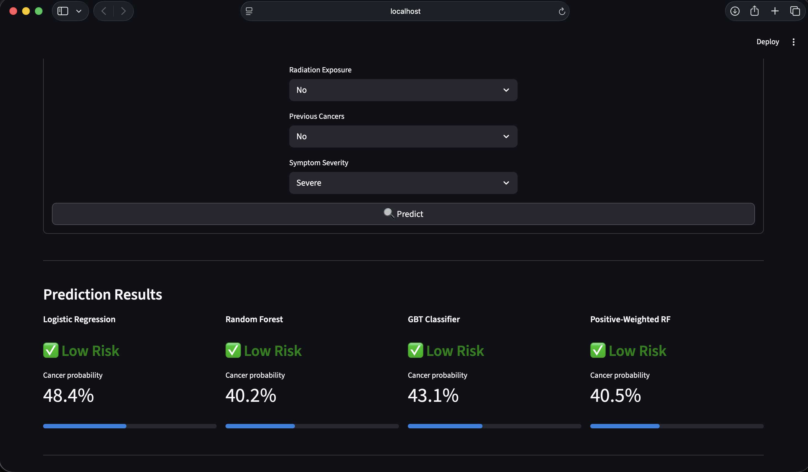

# Appendix Cancer Risk Prediction Model

A large-scale binary classification project that predicts **appendix cancer risk** from patient demographics, lifestyle factors, and clinical markers — trained on 260,000 records using **PySpark MLlib** and served via a **Streamlit** web application.

---

## Table of Contents

- [Project Overview](#project-overview)
- [Dataset](#dataset)
- [Exploratory Data Analysis](#exploratory-data-analysis)
- [Modeling Pipeline](#modeling-pipeline)
- [Model Results](#model-results)
- [Streamlit App](#streamlit-app)
- [Project Structure](#project-structure)
- [Getting Started](#getting-started)
- [Limitations](#limitations)

---

## Project Overview

This project builds an end-to-end ML pipeline to classify patients as at-risk or not for appendix cancer. The pipeline covers:

- Exploratory data analysis (EDA) with statistical significance testing
- Data cleaning, leakage removal, and feature engineering with PySpark
- Class-imbalance handling via balanced and positive-weighted class schemes
- Training and evaluation of four PySpark MLlib models
- A Streamlit UI for real-time inference against all four saved models

---

## Dataset

| Attribute | Value |
|-----------|-------|
| Records | 260,000 |
| Features | 25 (demographics, lifestyle, clinical measurements) |
| Target | `Appendix_Cancer_Prediction` (Yes / No → 1.0 / 0.0) |
| Cancer-Positive | 39,287 (15.1%) |
| Cancer-Negative | 220,713 (84.9%) |
| Class Ratio | ~5.6 : 1 (imbalanced) |

**Feature groups:**

| Group | Features |
|-------|----------|
| Demographics | Age, Gender, Country, BMI |
| Lifestyle | Smoking Status, Alcohol Consumption, Physical Activity Level, Diet Type |
| Medical History | Family History of Cancer, Genetic Mutations, Chronic Diseases, Previous Cancers, Radiation Exposure |
| Clinical Markers | Blood Pressure, Cholesterol Level, WBC Count, RBC Count, Platelet Count, Symptom Severity |

**Leakage columns removed before training:** `Survival_Years_After_Diagnosis`, `Diagnosis_Delay_Days`, `Treatment_Type`, `Tumor_Markers`

---

## Exploratory Data Analysis

Full EDA report: [EDA_Report_Jyotsana.md](EDA_Report_Jyotsana.md) | Notebook: [eda_jyotsana.ipynb](eda_jyotsana.ipynb)

**Key findings:**

- **Class imbalance (15.1% positive)** — a naive always-negative classifier would reach 84.9% accuracy, making AUC-ROC and F1 the correct evaluation metrics.
- **Gender is the only statistically significant feature** (χ² = 8.58, p = 0.014). All other 23 features are non-significant at α = 0.05.
- **No traditional cancer risk factor predicts the target** — smoking, alcohol, family history, genetic mutations, and radiation exposure all have p > 0.30.
- **All clinical blood markers are non-discriminative** — WBC, RBC, Platelet, Cholesterol, and Blood Pressure distributions overlap nearly perfectly between classes.
- **All feature-target correlations are near zero** (max |r| = 0.006), consistent with a synthetically generated dataset.
- **Geographic variation is narrow** — country cancer rates range between ~13% and ~17%, with no country being a meaningful outlier.

**Visualizations:**

| # | Figure |
|---|--------|
| 1 | [Target Class Distribution](viz1_target_distribution.png) |
| 2 | [Age & Gender Distributions](viz2_age_gender.png) |
| 3 | [Key Risk Factor Rates](viz3_risk_factors.png) |
| 4 | [BMI & Lifestyle](viz4_bmi_lifestyle.png) |
| 5 | [Correlation Heatmap](viz5_correlation_heatmap.png) |
| 6 | [Country Cancer Rates](viz6_country_rates.png) |
| 7 | [Age Group Trends](viz7_age_trends.png) |
| 8 | [Clinical Blood Markers (KDE)](viz8_clinical_markers.png) |
| 9 | [Feature Importance](viz_feature_importance.png) |

---

## Modeling Pipeline

Full training report: [Spark_Training_results_report.md](Spark_Training_results_report.md) | Notebook: [spark-training-pipeline.ipynb](spark-training-pipeline.ipynb)

**Preprocessing steps (PySpark):**

1. `dropDuplicates()` — remove exact duplicate rows
2. Remove leakage columns
3. `StringIndexer` → `OneHotEncoder` → `VectorAssembler` for categorical features
4. Balanced class weights applied via `sampleWeights` column
5. 80 / 20 stratified random split (`seed=42`) → test set: 51,840 records

**Class imbalance handling:**

- Standard balanced weights: `weight = total / (2 × class_count)`
- Positive-weighted RF experiment: minority class weight = `negative_count / positive_count` ≈ 5.62

**Models trained:**

1. Logistic Regression (with balanced weights)
2. Random Forest (with balanced weights)
3. Gradient-Boosted Tree (GBT) Classifier (with balanced weights)
4. Positive-Weighted Random Forest (minority class weight ≈ 5.62)

---

## Model Results

Evaluated on the held-out test set of 51,840 records.

| Model | AUC | Accuracy | F1 Score | Positive Recall | Train Time |
|-------|-----|----------|----------|----------------|------------|
| Logistic Regression | 0.4969 | 51.06% | 0.5792 | 47.63% | ~136s |
| **Random Forest** | **0.5022** | **66.31%** | **0.6975** | 27.03% | ~975s |
| GBT Classifier | 0.5004 | 53.42% | 0.6001 | 45.68% | ~1139s |
| Positive-Weighted RF | 0.5022 | 66.03% | 0.6956 | 27.24% | ~1029s |

**Best overall model: Random Forest** — highest accuracy (66.31%) and F1 (0.6975).

> **Note on AUC:** All models achieve AUC ≈ 0.50, meaning they are only marginally better than random ranking. This reflects the near-zero feature-target correlations found during EDA and is expected for a synthetically generated dataset. The Random Forest result serves as a meaningful baseline.

**Recall trade-off:**
- Logistic Regression and GBT catch ~47% and ~46% of true cancer cases respectively, but with high false-positive rates.
- Random Forest achieves the best overall F1 but only detects ~27% of true positive cases.

---

## Streamlit App

The Streamlit application ([app.py](app.py)) loads all four saved PySpark ML pipeline models and lets users enter patient details to get side-by-side predictions.

**Screenshots:**



**Features:**
- Patient input form: demographics, lifestyle, and clinical measurements
- Simultaneous inference from all 4 models
- Cancer probability score and progress bar per model
- Model comparison table with training metrics

**Running the app:**

```bash
# Install dependencies
pip install streamlit pyspark pandas

# Extract trained models
tar -xzf trained_models.tar.gz

# Launch
streamlit run app.py
```

> The app starts a local Spark session on first run (~20 seconds). Java 17+ users: the JVM flags in `load_resources()` handle `javax.security.auth` restrictions automatically.

---

## Project Structure

```
Appendix-Cancer-Risk-Prediction-Model/
├── app.py                              # Streamlit inference app
├── Complete_Project_Notebook.ipynb     # End-to-end project notebook
├── eda_jyotsana.ipynb                  # EDA notebook
├── spark-training-pipeline.ipynb       # PySpark training notebook
├── EDA_Report_Jyotsana.md             # Detailed EDA findings
├── Spark_Training_results_report.md   # Model training results
├── appendix_cancer_prediction_dataset.csv
├── trained_models.tar.gz              # Saved PySpark pipeline models
│   ├── logistic_regression_model/
│   ├── random_forest_model/
│   ├── gbt_model/
│   └── rf_model_positive_weighted/
└── viz*.png                           # EDA visualizations
```

---

## Getting Started

**Prerequisites:**
- Python 3.8+
- Java 11 or 17 (required by PySpark)
- Apache Spark 3.x

```bash
# Clone the repository
git clone https://github.com/<your-username>/Appendix-Cancer-Risk-Prediction-Model.git
cd Appendix-Cancer-Risk-Prediction-Model

# Install Python dependencies
pip install pyspark streamlit pandas

# Extract trained models
tar -xzf trained_models.tar.gz

# Run EDA notebook
jupyter notebook eda_jyotsana.ipynb

# Run training notebook
jupyter notebook spark-training-pipeline.ipynb

# Launch the Streamlit app
streamlit run app.py
```

---

## Limitations

1. **AUC ≈ 0.50 across all models** — the features contain almost no predictive signal for the target, consistent with synthetic data generation.
2. **Low positive-class precision** — all models have high false-positive rates for the cancer class.
3. **Limited positive recall in tree-based models** — Random Forest only catches ~27% of true cancer cases despite best F1.
4. **Synthetic dataset** — feature-target independence means findings may not generalize to real clinical settings.
5. **High training time** — GBT and Random Forest required 16–19 minutes each on a single machine.
6. **SMOTE not feasible** — distributed SMOTE caused out-of-memory errors in Spark; alternative oversampling strategies were not explored.

---


